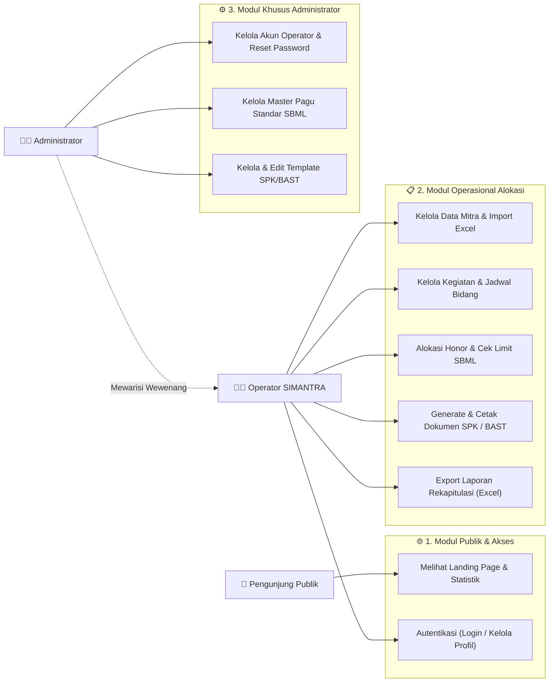
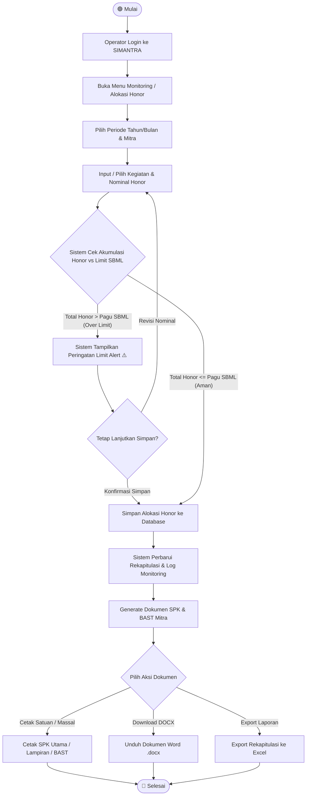
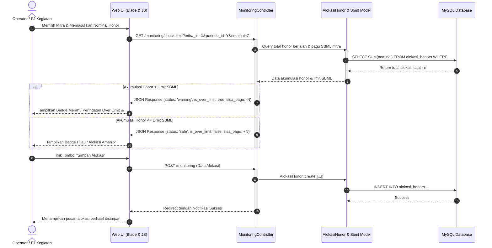
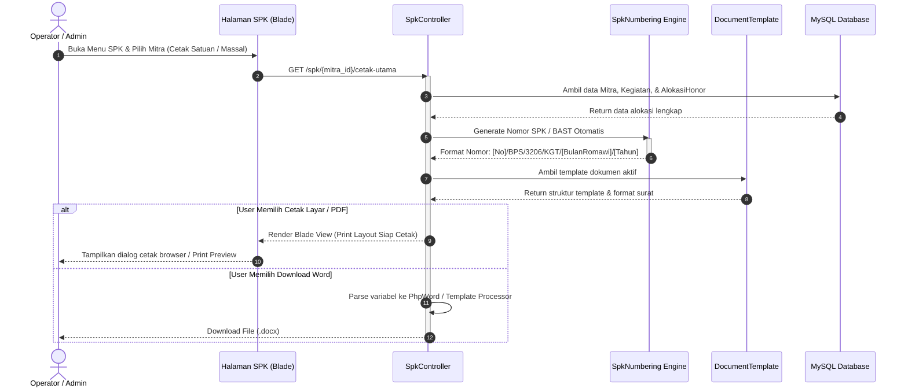
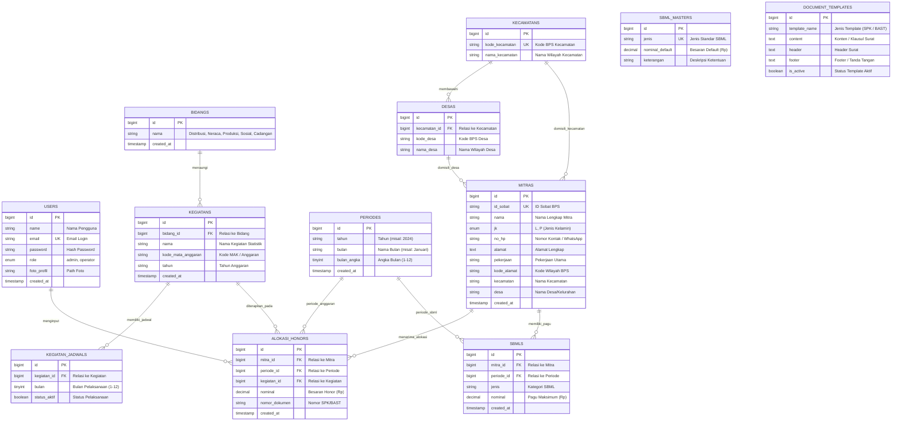
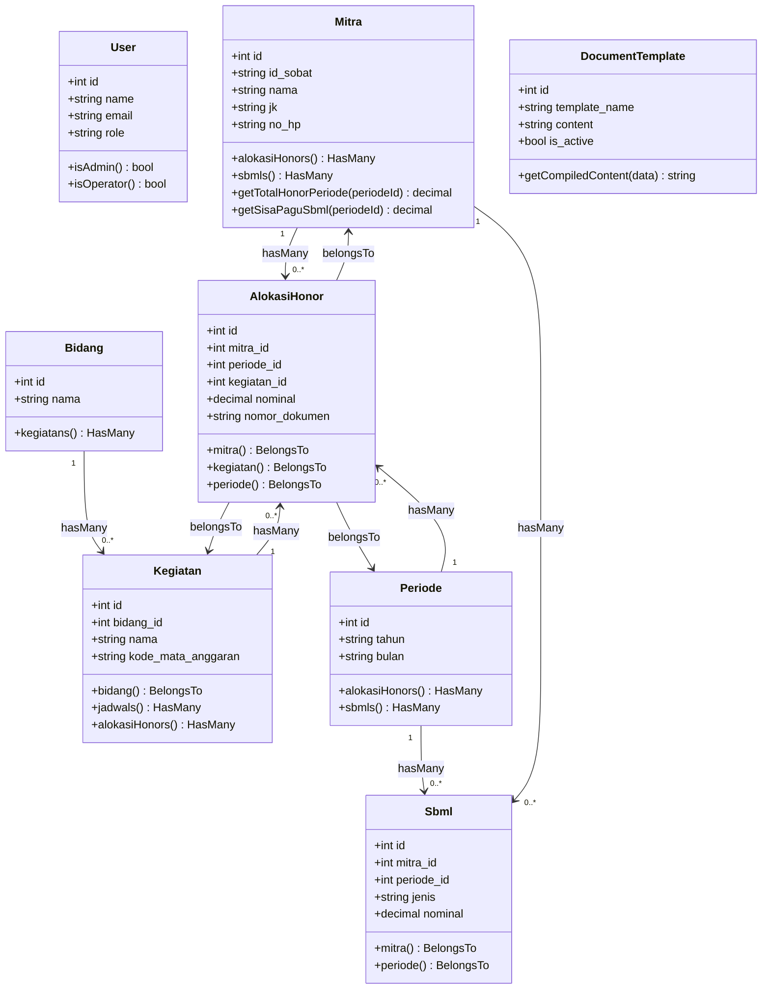
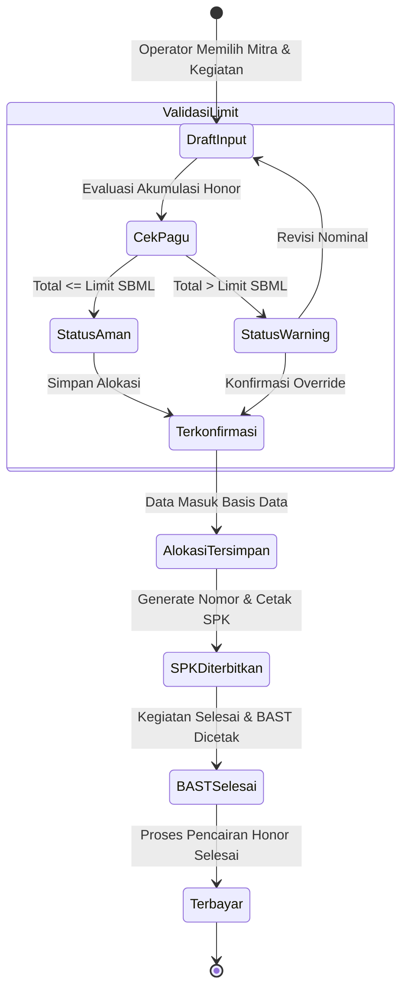
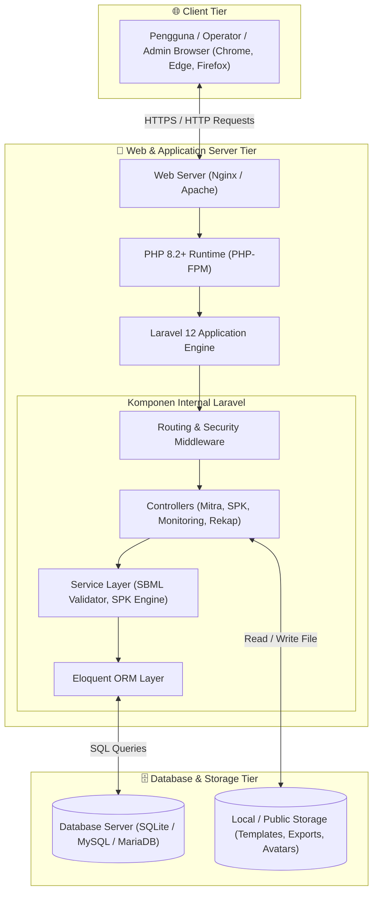

<p align="center">
  
</p>

<h1 align="center">✨ SIMANTRA ✨</h1>
<p align="center">
  <strong>Sistem Informasi Monitoring Alokasi Pekerjaan dan Honor Mitra</strong><br>
  <em>Solusi Terpadu Manajemen Mitra Statistik, Validasi Limit SBML, dan Otomasi Dokumen SPK/BAST BPS</em>
</p>

<p align="center">
  
  = 8.2">
  
  
  
  
</p>

## 📌 Navigasi & Daftar Isi

| 📂 Kategori | 🔗 Pintasan Bagian & Diagram | 📝 Deskripsi |
| :--- | :--- | :--- |
| **🌟 Ringkasan Proyek** | • [Tentang SIMANTRA](#-tentang-simantra)<br>• [Fitur Unggulan](#-fitur-unggulan)<br>• [Struktur Direktori](#-struktur-direktori-utama) | Ikhtisar sistem BPS, keunggulan fitur, dan hierarki folder. |
| **📐 Diagram Rancang Bangun** | **Alur & Wewenang:**<br>• [1. Use Case Diagram](#1-use-case-diagram)<br>• [2. Activity Diagram (Alokasi & SBML)](#2-activity-diagram-alokasi-honor--validasi-sbml)<br>• [3. Sequence Validasi Limit SBML](#3-sequence-diagram-validasi-real-time-limit-sbml)<br>• [4. Sequence Cetak SPK/BAST](#4-sequence-diagram-generate--cetak-dokumen-spkbast)<br><br>**Data & Arsitektur:**<br>• [5. Entity-Relationship Diagram (ERD)](#5-entity-relationship-diagram-erd)<br>• [6. Class Diagram (Model Eloquent)](#6-class-diagram-domain-model-eloquent)<br>• [7. State Machine Status Alokasi](#7-state-machine-diagram-siklus-status-alokasi--dokumen)<br>• [8. Arsitektur & Deployment Server](#8-diagram-arsitektur--deployment-sistem) | Kumpulan 8 diagram visualisasi alur bisnis, database relasional, dan arsitektur sistem. |
| **🛠️ Instalasi & Konfigurasi** | • [Persyaratan Sistem](#-persyaratan-sistem)<br>• [Panduan Instalasi Langkah-demi-Langkah](#-panduan-instalasi--setup)<br>• [Kredensial Akun Default](#-akun-pengguna-default) | Petunjuk instalasi lokal, migrasi database, dan data akun login. |
| **🧪 Testing & Legalitas** | • [Pengujian Otomatis (PHPUnit)](#-pengujian-otomatis)<br>• [Lisensi Proyek](#-lisensi) | Perintah eksekusi test cases dan lisensi open-source MIT. |

---

## 📖 Tentang SIMANTRA

**SIMANTRA** (*Sistem Informasi Monitoring Alokasi Pekerjaan dan Honor Mitra*) adalah platform web terpadu yang dirancang khusus untuk mempermudah tata kelola administrasi mitra pada Badan Pusat Statistik (BPS).

Sistem ini hadir untuk mengatasi tantangan operasional seperti:
- Pengawasan alokasi pekerjaan mitra lintas bidang statistik agar merata.
- **Pencegahan pelanggaran pagu anggaran / Standar Biaya Masukan Lainnya (SBML)** secara otomatis sebelum Surat Perjanjian Kerja (SPK) diterbitkan.
- Otomasi pembuatan dan pencetakan dokumen legalitas: **SPK Utama**, **Lampiran Rincian Tugas**, dan **Berita Acara Serah Terima (BAST)** dalam format cetak maupun file Word (.docx).
- Rekapitulasi honor bulanan mitra yang siap diekspor ke format pelaporan standar Excel.

---

## 🚀 Fitur Unggulan

| Modul / Fitur | Rincian Fungsionalitas |
| :--- | :--- |
| 📊 **Executive Dashboard** | Grafik distribusi honor per bidang, statistik beban kerja mitra, animasi counter angka, dan indikator status batas SBML multi-tugas. |
| 👥 **Master Mitra & Wilayah** | Data lengkap mitra statistik (ID Sobat, Nama, NIK/No HP, Jenis Kelamin, Wilayah Kecamatan & Desa) dengan pagination tabel (15 data/hal) dan batch Import Excel. |
| 📋 **Master Kegiatan & Jadwal** | Pengelompokan kegiatan per bidang statistik (Distribusi, Neraca, Produksi, Sosial, Cadangan), kode mata anggaran, matriks jadwal, dan deteksi otomatis kategori tugas (Badge Pencacahan / Pengolahan). |
| 🛡️ **Validasi SBML Multi-Tugas** | Pengecekan real-time batas honor bulanan per kategori tugas (Pencacahan Lapangan, Pengolahan Data, dan Total Gabungan) dengan master pagu per tahun anggaran di `/master-sbml`. |
| 🔢 **Penomoran Fleksibel & CRUD Pola** | Modul penomoran SPK/BAST dengan pengelolaan pola nomor dinamis (Tambah, Edit, Hapus, Reset ke Standar BPS), live preview nomor pertama, dan deteksi nomor terakhir di database. |
| 📄 **Generator SPK & BAST (Word & PDF)** | Pembuatan dokumen SPK Utama, Lampiran Rincian Tugas, dan BAST dalam format cetak browser, berkas Microsoft Word (.docx), dan berkas PDF otentik siap pakai satuan maupun massal. |
| 📥 **Import & Export Excel** | Dukungan impor master data mitra/kegiatan dan ekspor rekap honor format Excel (.xlsx) menggunakan PhpSpreadsheet. |
| 🔐 **Manajemen Hak Akses (RBAC)** | Pemisahan peran antara **Administrator** (Full System & User Control) dan **Operator** (Operasional Alokasi & Pencetakan). |

---

## 📐 Diagram Sistem & Penjelasan

Berikut adalah kumpulan diagram rancang bangun sistem SIMANTRA yang disajikan menggunakan standar **Mermaid** beserta penjelasan detail di setiap diagramnya.

---

### 1. Use Case Diagram
Diagram ini memetakan pembagian wewenang dan hak akses fungsionalitas sistem secara terstruktur per modul.



#### 📝 Penjelasan Use Case:
1. **Pengunjung Publik**: Hanya dapat mengakses landing page publik untuk melihat ringkasan informasi dan transparansi statistik umum.
2. **Operator SIMANTRA**: Bertugas mengelola data operasional harian, mencakup input mitra, penugasan kegiatan, pemantauan batas limit SBML, pengunduhan rekap Excel, serta pencetakan dokumen SPK dan BAST.
3. **Administrator**: Memiliki seluruh wewenang Operator ditambah kontrol sistem: manajemen akun operator, pengaturan hak akses, konfigurasi template dokumen dinamis, dan penyesuaian master pagu SBML.

---

### 2. Activity Diagram (Alokasi Honor & Validasi SBML)
Diagram ini menjelaskan alur aktivitas saat operator menginput honor mitra hingga sistem melakukan pengecekan batas anggaran SBML.



#### 📝 Penjelasan Activity:
1. Operator memilih mitra dan periode anggaran yang akan dialokasikan penugasannya.
2. Sistem secara otomatis menjumlahkan seluruh honor mitra di bulan tersebut dan membandingkannya dengan limit SBML yang berlaku.
3. Jika total honor melebihi batas ketentuan SBML, sistem menampilkan status peringatan (*Warning Alert*). Operator dapat merevisi atau mengonfirmasi penugasan.
4. Setelah tersimpan, data otomatis masuk ke antrean cetak SPK/BAST dan rekapitulasi honor bulanan.

---

### 3. Sequence Diagram (Validasi Real-time Limit SBML)
Diagram urutan interaksi komponen aplikasi saat validasi honor dilakukan dari sisi antarmuka pengguna hingga ke basis data.



#### 📝 Penjelasan Sequence Validasi:
1. **Asynchronous Check**: Ketika user memilih mitra atau mengisi nominal honor di form, antarmuka memicu request pengecekan ke `MonitoringController`.
2. **Kalkulasi Cepat**: Controller menghitung total alokasi bulan berjalan ditambah alokasi baru, lalu membandingkannya dengan limit SBML mitra.
3. **Feedback Visual Instan**: UI memberikan respons warna status (hijau = aman, merah = melebihi limit) sebelum tombol simpan diklik.

---

### 4. Sequence Diagram (Generate & Cetak Dokumen SPK/BAST)
Diagram urutan proses penerbitan surat perjanjian kerja dan berita acara serah terima.



#### 📝 Penjelasan Sequence Dokumen:
1. Sistem mengambil data mitra beserta seluruh rincian kegiatan yang dibebankan pada bulan terpilih.
2. Mesin penomoran (`SpkNumbering Engine`) menyusun format nomor surat dinamis sesuai kaidah tata naskah dinas BPS.
3. Sistem menyuntikkan data tersebut ke template dokumen untuk langsung dicetak via browser atau diunduh dalam format Word (.docx).

---

### 5. Entity-Relationship Diagram (ERD)
Diagram relasi database yang menunjukkan struktur tabel, atribut, dan hubungan antarentitas pada basis data SIMANTRA.



#### 📝 Penjelasan ERD:
1. **Entitas Pusat (`ALOKASI_HONORS`)**: Berfungsi sebagai tabel transaksi yang menghubungkan `MITRAS`, `KEGIATANS`, dan `PERIODES`.
2. **Kontrol SBML (`SBMLS` & `SBML_MASTERS`)**: Menyimpan batas maksimum penerimaan honor per mitra untuk setiap periode anggaran.
3. **Master Wilayah (`KECAMATANS` & `DESAS`)**: Mendukung normalisasi data domisili mitra statistik.
4. **Template Dinamis (`DOCUMENT_TEMPLATES`)**: Menyimpan format redaksi klausul SPK dan BAST agar dapat dikonfigurasi langsung oleh Administrator.

---

### 6. Class Diagram (Domain Model Eloquent)
Diagram struktur kelas yang menggambarkan model data Eloquent di Laravel beserta relasi method OOP antar entitas.



#### 📝 Penjelasan Class Diagram:
1. `Mitra` memiliki method pembantu untuk menghitung akumulasi total honor dan sisa pagu SBML dalam periode tertentu.
2. `AlokasiHonor` bertindak sebagai model relasi many-to-many berbobot (*pivot with attributes*) antara `Mitra`, `Kegiatan`, dan `Periode`.
3. `DocumentTemplate` menyediakan abstraksi untuk memproses parsing placeholder variabel ke dalam format dokumen final.

---

### 7. State Machine Diagram (Siklus Status Alokasi & Dokumen)
Diagram status yang menunjukkan siklus hidup satu alokasi honor sejak awal input sampai penerbitan dokumen legalitas selesai.



#### 📝 Penjelasan State Machine:
1. Setiap entri penugasan berawal dari status **DraftInput**.
2. Sistem mengevaluasi kondisi batas honor: jika aman maka langsung masuk **Terkonfirmasi**, jika melebihi pagu maka beralih ke **StatusWarning**.
3. Setelah data tersimpan, dokumen **SPK** dapat diterbitkan. Saat pelaksanaan kegiatan usai, dokumen **BAST** disahkan untuk pencairan honor (*Terbayar*).

---

### 8. Diagram Arsitektur & Deployment Sistem
Diagram yang menggambarkan susunan infrastruktur server dan interaksi lapisan software pada lingkungan operasional SIMANTRA.



#### 📝 Penjelasan Arsitektur & Deployment:
1. **Client Tier**: Menjalankan aplikasi berbasis web responsif dengan Tailwind CSS dan Vite.
2. **Application Server Tier**: Memproses request melalui Nginx/Apache dan diteruskan ke PHP-FPM Laravel 12 yang mengeksekusi middleware keamanan, controller, dan business logic service.
3. **Database & Storage Tier**: Mengelola penyimpanan data relasional terstruktur pada MySQL dan berkas dokumen/template pada filesystem storage.

---

## 💻 Persyaratan Sistem

Sebelum melakukan instalasi, pastikan lingkungan komputer atau server Anda memenuhi persyaratan berikut:

- **PHP**: Versi `>= 8.2`
- **Ekstensi PHP Wajib**:
  - `bcmath`, `ctype`, `curl`, `dom`, `fileinfo`, `filter`, `hash`, `mbstring`, `openssl`, `pcre`, `pdo`, `pdo_mysql` *(atau `pdo_sqlite`)*, `session`, `tokenizer`, `xml`, `zip`, `gd`
- **Composer**: Versi `>= 2.2`
- **Node.js & NPM**: Node.js `>= 18.x` & NPM `>= 9.x`
- **Database**: MySQL `>= 8.0` / MariaDB `>= 10.4` / SQLite `>= 3.35`
- **Git**: Versi terbaru

---

## 🛠️ Panduan Instalasi & Setup

Ikuti langkah-langkah di bawah ini untuk menginstal dan menjalankan SIMANTRA secara lokal:

### 1. Kloning Repositori
```bash
git clone https://github.com/supyan1403/SIMANTRA.git
cd SIMANTRA
```

### 2. Instal Dependensi Backend (PHP)
```bash
composer install
```

### 3. Instal Dependensi Frontend (Node.js)
```bash
npm install
```

### 4. Konfigurasi File Environment (`.env`)
Salin file `.env.example` menjadi `.env`:
```bash
# Untuk Linux / macOS / Git Bash:
cp .env.example .env

# Untuk Windows (Command Prompt / PowerShell):
copy .env.example .env
```

Buka file `.env` dan pastikan koneksi database menggunakan SQLite (pengaturan default project):
```env
APP_NAME="SIMANTRA"
APP_ENV=local
APP_KEY=
APP_DEBUG=true
APP_URL=http://localhost:8000

# Konfigurasi Database SQLite (default SIMANTRA)
DB_CONNECTION=sqlite
# Tidak perlu DB_HOST / DB_PORT / DB_USERNAME / DB_PASSWORD
```
*(Catatan: File basis data `database/database.sqlite` akan dibuat otomatis saat migrasi dijalankan. Tidak perlu menginstal atau mengonfigurasi server database seperti MySQL/MariaDB atau phpMyAdmin.)*

Kemudian generate application key:
```bash
php artisan key:generate
```

### 5. Jalankan Migrasi & Seeder Data Awal (Instalasi Baru)
Perintah ini akan membuat seluruh tabel basis data, mengisi data master bidang, kecamatan, desa, aturan SBML, dan data bawaan MANTRA:
```bash
php artisan migrate --seed
```
> 💡 **Data MANTRA otomatis**: Basis data proyek ini sudah menyertakan `database/database.sqlite` lengkap (2.566 Mitra, 47 Kegiatan, 737 Alokasi Honor, dan Aturan SBML 2024/2025). Anda **tidak perlu** melakukan import manual.

---

## 🔄 Panduan Sinkronisasi (Untuk Rekan Tim yang Sudah Clone)

Bagi rekan satu tim yang sebelumnya sudah meng-clone repositori ini, untuk mendapatkan **100% seluruh pembaruan kode, perbaikan UI Sidebar, serta data database terbaru**, Anda **cukup menjalankan**:

```bash
# 1. Tarik seluruh perubahan kode dan database terbaru
git pull origin main

# 2. Jalankan server aplikasi
php artisan serve
```

> [!TIP]
> Begitu perintah di atas dijalankan, seluruh tampilan baru, perbaikan sidebar zero-shift, master SBML multi-kategori, dan 2.566 data mitra riil langsung aktif dan sama persis 100% di komputer Anda tanpa perlu konfigurasi tambahan.

---

## 🔑 Akun Pengguna Default

Database telah menyediakan 2 (dua) akun pengguna siap pakai:

| Role | Email | Password | Hak Akses & Kemampuan |
| :--- | :--- | :--- | :--- |
| **Administrator** | `admin@bps.go.id` | `password` | Akses penuh seluruh sistem: Kelola Pengguna, Reset Password, Kelola Master SBML (Pencacahan, Pengolahan, Gabungan), Template Dokumen SPK/BAST, Manajemen Mitra & Kegiatan. |
| **Operator** | `operator@bps.go.id` | `password` | Akses operasional: Kelola Mitra, Kelola Kegiatan & Jadwal, Alokasi Honor, Validasi SBML Multi-Tugas, Monitoring, Cetak SPK/BAST & Export Excel. |

---

## 🧪 Pengujian Otomatis

SIMANTRA dilengkapi dengan rangkaian pengujian fitur (*Feature & Unit Tests*) menggunakan PHPUnit:

```bash
# Menjalankan seluruh pengujian
php artisan test

# Menjalankan pengujian fitur penomoran SPK
php artisan test --filter=SpkNumberingTest

# Menjalankan pengujian keamanan riwayat halaman & otentikasi
php artisan test --filter=SecurityBackHistoryTest
```

---

## 📁 Struktur Direktori Utama

```
SIMANTRA/
├── app/
│   ├── Http/
│   │   ├── Controllers/       # Controller (Mitra, Kegiatan, Monitoring, Spk, dsb.)
│   │   └── Middleware/        # Middleware (AdminMiddleware, PreventBackHistory)
│   └── Models/                # Eloquent Models (Mitra, AlokasiHonor, Sbml, dsb.)
├── database/
│   ├── migrations/            # Skema migrasi database
│   └── seeders/               # Seeder data master, kecamatan/desa & mantra_db
├── public/                    # Entry point aplikasi (index.php) & aset terkompilasi
├── resources/
│   ├── css/                   # Stylesheet Tailwind CSS
│   ├── js/                    # Skrip JavaScript & Vite
│   └── views/                 # Blade Templates (Dashboard, SPK, Mitra, Rekap)
├── routes/
│   ├── web.php                # Rute utama aplikasi web
│   └── auth.php               # Rute autentikasi Laravel Breeze
└── tests/                     # Unit & Feature Test cases
```

---

## 📄 Lisensi

Proyek aplikasi SIMANTRA dilisensikan di bawah [MIT License](LICENSE).
Dikembangkan untuk mendukung efisiensi tata kelola administrasi dan monitoring mitra statistik BPS.
