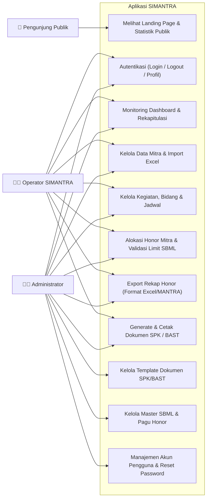
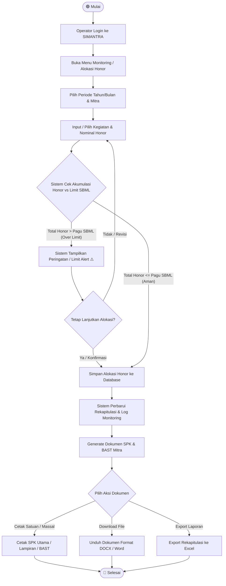
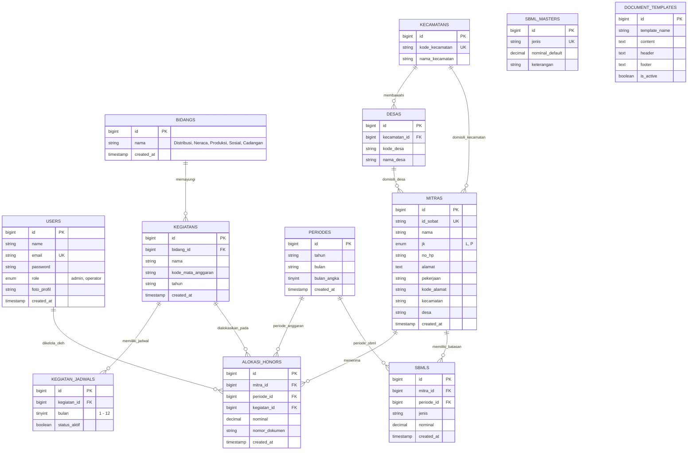
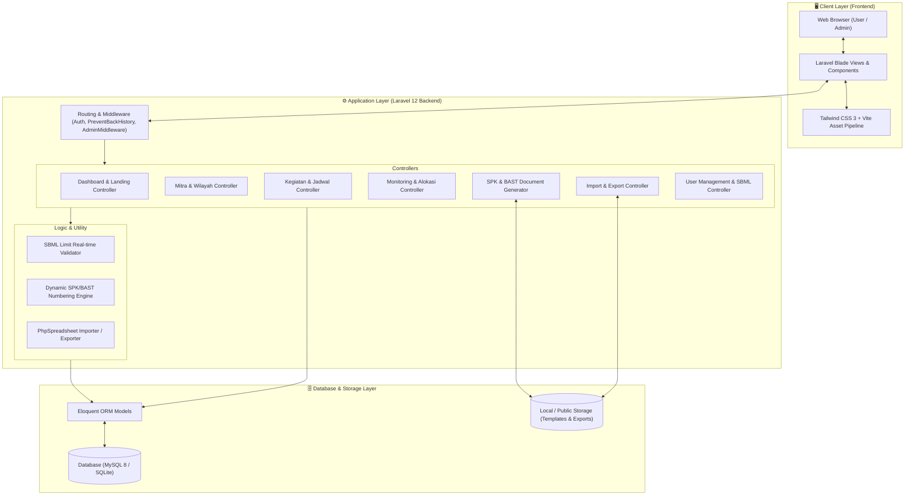

<p align="center">
  
</p>

<h1 align="center">✨ SIMANTRA ✨</h1>
<p align="center">
  <strong>Sistem Informasi Monitoring Alokasi Pekerjaan dan Honor Mitra</strong><br>
  <em>Solusi Terpadu Manajemen Mitra Statistik, Validasi Limit SBML, dan Otomasi Dokumen SPK/BAST BPS</em>
</p>

<p align="center">
  
  = 8.2">
  
  
  
  
</p>

---

## 📌 Daftar Isi
1. [Tentang SIMANTRA](#-tentang-simantra)
2. [Fitur Unggulan](#-fitur-unggulan)
3. [Diagram Sistem (Mermaid)](#-diagram-sistem)
   - [1. Use Case Diagram](#1-use-case-diagram)
   - [2. Activity Diagram (Alur Alokasi Honor & Validasi SBML)](#2-activity-diagram-alur-alokasi-honor--validasi-sbml)
   - [3. Entity-Relationship Diagram (ERD)](#3-entity-relationship-diagram-erd)
   - [4. Diagram Arsitektur Aplikasi](#4-diagram-arsitektur-aplikasi)
4. [Persyaratan Sistem (Prerequisites)](#-persyaratan-sistem)
5. [Panduan Instalasi & Setup](#-panduan-instalasi--setup)
6. [Akun Pengguna Default (Default Credentials)](#-akun-pengguna-default)
7. [Panduan Menjalankan Pengujian (Testing)](#-pengujian-otomatis)
8. [Lisensi](#-lisensi)

---

## 📖 Tentang SIMANTRA

**SIMANTRA** (*Sistem Informasi Monitoring Alokasi Pekerjaan dan Honor Mitra*) adalah platform berbasis web modern yang dirancang untuk mendukung operasional Badan Pusat Statistik (BPS) dalam:
- Mengelola data master mitra statistik dan sebaran wilayah kerja (Kecamatan/Desa).
- Mengontrol alokasi beban kerja dan penugasan kegiatan per bidang statistik.
- **Mencegah pelanggaran pagu anggaran / Standar Biaya Masukan Lainnya (SBML)** secara *real-time* sebelum data dikomit.
- Mengotomatiskan pembuatan dan pencetakan dokumen legalitas: **Surat Perjanjian Kerja (SPK)** dan **Berita Acara Serah Terima (BAST)** baik satuan maupun massal.
- Menyediakan rekapitulasi data dan ekspor data sesuai standar format pelaporan MANTRA.

---

## 🚀 Fitur Unggulan

| Fitur | Deskripsi |
| :--- | :--- |
| 📊 **Executive Dashboard** | Menampilkan metrik real-time statistik mitra, grafik distribusi alokasi per bidang kegiatan, dan deteksi peringatan honor mendekati/melebihi limit. |
| 👥 **Manajemen Master Mitra** | Pengelolaan data mitra terintegrasi (ID Sobat, Nama, NIK/No HP, Jenis Kelamin, Wilayah Kecamatan & Desa) dengan dukungan Import Excel batch. |
| 📋 **Manajemen Kegiatan & Jadwal** | Pengelompokan kegiatan per bidang (Distribusi, Neraca, Produksi, Sosial, Cadangan) disertai kode mata anggaran dan matriks jadwal bulanan. |
| ⚠️ **Validasi Real-time Limit SBML** | Sistem otomatis memvalidasi total akumulasi honor per mitra dalam satu bulan anggaran dan memunculkan peringatan/pencegahan jika melebihi pagu SBML. |
| 📄 **Generator & Cetak SPK/BAST** | Cetak langsung (Print view PDF/Browser) atau unduh DOCX untuk SPK Utama, Lampiran Rincian, dan BAST dengan penomoran surat otomatis & template dinamis. |
| 📥 **Import & Export Excel** | Dukungan impor data mitra & kegiatan serta ekspor rekapitulasi alokasi bulanan format Excel (.xlsx) menggunakan PhpSpreadsheet. |
| 🛡️ **Role-Based Access Control** | Pembagian hak akses terproteksi antara **Administrator** (Kelola User, Template Dokumen, Master SBML) dan **Operator** (Kelola Operasional Alokasi). |

---

## 📐 Diagram Sistem

### 1. Use Case Diagram
Diagram ini memetakan interaksi fungsional antara aktor (**Pengunjung Publik**, **Operator SIMANTRA**, dan **Administrator**) dengan sistem.



---

### 2. Activity Diagram (Alur Alokasi Honor & Validasi SBML)
Diagram aktivitas berikut menggambarkan alur kerja mulai dari penugasan mitra pada kegiatan, kalkulasi otomatis batas limit SBML, hingga penerbitan dokumen SPK/BAST.



---

### 3. Entity-Relationship Diagram (ERD)
Diagram relasi entitas basis data SIMANTRA memperlihatkan keterhubungan antartabel utama.



---

### 4. Diagram Arsitektur Aplikasi
Struktur arsitektur berlapis (*layered architecture*) aplikasi SIMANTRA:



---

## 💻 Persyaratan Sistem

Sebelum melakukan instalasi, pastikan lingkungan server/komputer Anda memenuhi spesifikasi berikut:

- **PHP**: Versi `>= 8.2`
- **Ekstensi PHP Wajib**:
  - `bcmath`, `ctype`, `curl`, `dom`, `fileinfo`, `filter`, `hash`, `mbstring`, `openssl`, `pcre`, `pdo`, `pdo_mysql` *(atau `pdo_sqlite`)*, `session`, `tokenizer`, `xml`, `zip`, `gd`
- **Composer**: Versi `>= 2.2`
- **Node.js & NPM**: Node.js `>= 18.x` & NPM `>= 9.x`
- **Database**: MySQL `>= 8.0` / MariaDB `>= 10.4` / SQLite `>= 3.35`
- **Git**: Versi terbaru

---

## 🛠️ Panduan Instalasi & Setup

Ikuti langkah-langkah berikut untuk menginstal SIMANTRA secara lokal pada komputer atau server pengembangan:

### 1. Kloning Repositori
```bash
git clone https://github.com/username/SIMANTRA.git
cd SIMANTRA
```

### 2. Instal Dependensi Backend (PHP)
```bash
composer install
```

### 3. Instal Dependensi Frontend (Node.js)
```bash
npm install
```

### 4. Konfigurasi File Environment (`.env`)
Salin file template environment dan buat application key:
```bash
# Untuk Linux / macOS / Git Bash:
cp .env.example .env

# Untuk Windows (Command Prompt / PowerShell):
copy .env.example .env
```

Buka file `.env` dengan teks editor, lalu sesuaikan koneksi database Anda:
```env
APP_NAME="SIMANTRA"
APP_ENV=local
APP_KEY=
APP_DEBUG=true
APP_URL=http://localhost:8000

# Konfigurasi Database (Contoh MySQL)
DB_CONNECTION=mysql
DB_HOST=127.0.0.1
DB_PORT=3306
DB_DATABASE=simantra_db
DB_USERNAME=root
DB_PASSWORD=
```
*(Catatan: Buat database baru bernama `simantra_db` pada phpMyAdmin / MySQL client Anda jika menggunakan MySQL).*

Kemudian generate application key:
```bash
php artisan key:generate
```

### 5. Jalankan Migrasi & Seeder Data Awal
Perintah ini akan membuat seluruh tabel basis data, mengisi data master bidang, kecamatan, desa, aturan SBML, dan data bawaan MANTRA:
```bash
php artisan migrate --seed
```

### 6. Buat Symbolic Link Storage
Untuk memastikan berkas profil dan dokumen template dapat diakses:
```bash
php artisan storage:link
```

### 7. Kompilasi Aset Frontend
```bash
# Untuk mode pengembangan (Hot Reload):
npm run dev

# ATAU untuk membuat bundle produksi:
npm run build
```

### 8. Jalankan Server Aplikasi
Buka terminal baru dan jalankan server lokal Laravel:
```bash
php artisan serve
```
Aplikasi sekarang dapat diakses melalui browser di alamat: **`http://localhost:8000`** 🚀

> 💡 **Tip:** Anda juga dapat menjalankan server dan asset watcher secara bersamaan menggunakan perintah:
> ```bash
> composer run dev
> ```

---

## 🔑 Akun Pengguna Default

Database Seeder telah menyediakan 2 (dua) akun pengguna siap pakai:

| Role | Email | Password | Hak Akses & Kemampuan |
| :--- | :--- | :--- | :--- |
| **Administrator** | `admin@bps.go.id` | `password` | Akses penuh seluruh sistem: Kelola Pengguna, Reset Password, Kelola Master SBML, Template Dokumen SPK/BAST, Manajemen Mitra & Kegiatan. |
| **Operator** | `operator@bps.go.id` | `password` | Akses operasional: Kelola Mitra, Kelola Kegiatan & Jadwal, Alokasi Honor, Validasi SBML, Monitoring, Cetak SPK/BAST & Export Excel. |

---

## 🧪 Pengujian Otomatis

SIMANTRA dilengkapi dengan rangkaian pengujian fitur (*Feature & Unit Tests*) menggunakan PHPUnit:

```bash
# Menjalankan seluruh pengujian
php artisan test

# Menjalankan pengujian fitur penomoran SPK
php artisan test --filter=SpkNumberingTest

# Menjalankan pengujian otentikasi & keamanan riwayat halaman
php artisan test --filter=SecurityBackHistoryTest
```

---

## 📁 Struktur Direktori Utama

```
SIMANTRA/
├── app/
│   ├── Http/
│   │   ├── Controllers/       # Controller (Mitra, Kegiatan, Monitoring, Spk, dsb.)
│   │   └── Middleware/        # Middleware (AdminMiddleware, PreventBackHistory)
│   └── Models/                # Eloquent Models (Mitra, AlokasiHonor, Sbml, dsb.)
├── database/
│   ├── migrations/            # Skema migrasi database
│   └── seeders/               # Seeder data master, kecamatan/desa & mantra_db
├── public/                    # Entry point aplikasi (index.php) & aset terkompilasi
├── resources/
│   ├── css/                   # Stylesheet Tailwind CSS
│   ├── js/                    # Skrip JavaScript & Vite
│   └── views/                 # Blade Templates (Dashboard, SPK, Mitra, Rekap)
├── routes/
│   ├── web.php                # Rute utama aplikasi web
│   └── auth.php               # Rute autentikasi Laravel Breeze
└── tests/                     # Unit & Feature Test cases
```

---

## 📄 Lisensi

Proyek aplikasi SIMANTRA dilisensikan di bawah [MIT License](LICENSE).
Dikembangkan untuk mendukung efisiensi tata kelola administrasi dan monitoring mitra statistik BPS.
